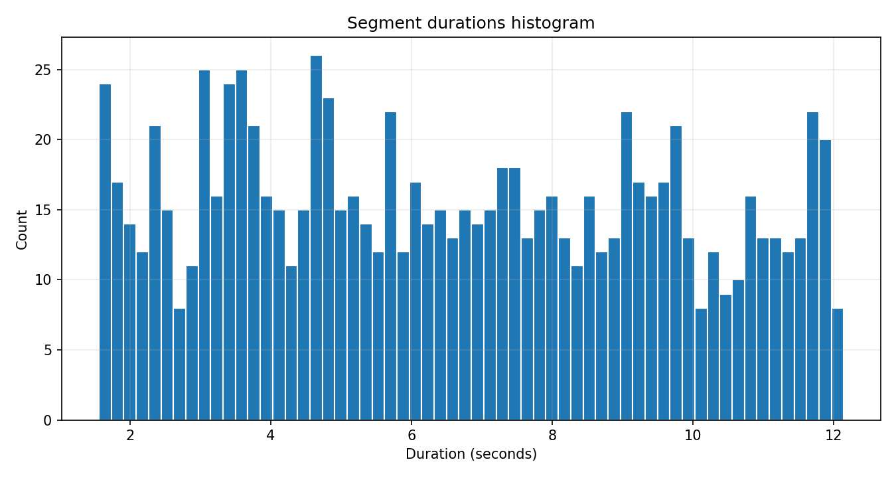
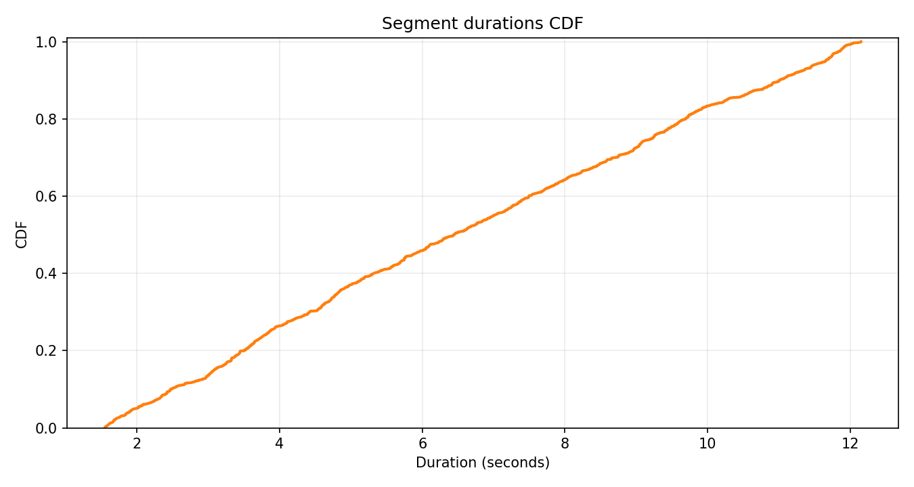
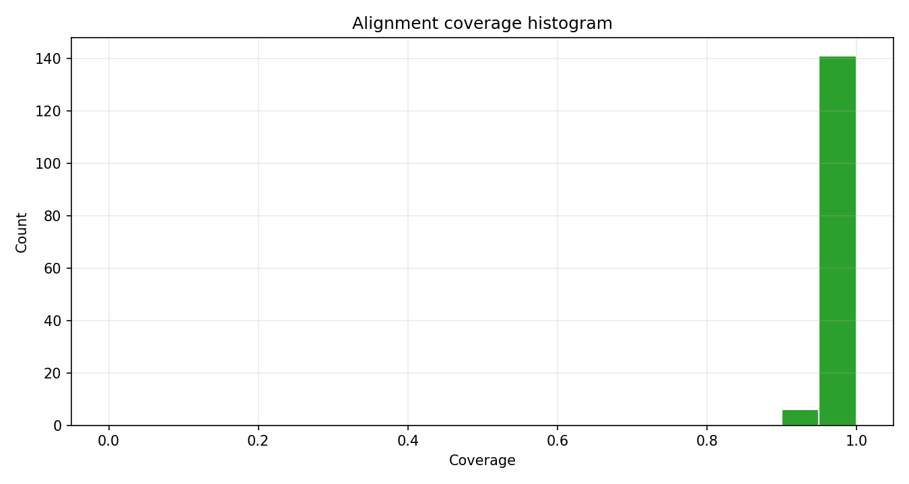
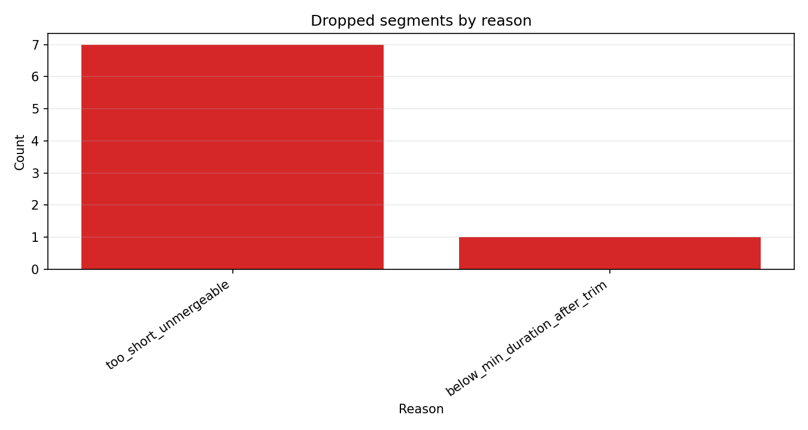

# Darija TTS release package

This repository packages a WhisperX-aligned Darija TTS export into a clean,
training-ready dataset and a reproducible open-source release workflow.

## What this project does

- Preserves transcript text while refining timestamps with forced alignment
- Builds normalized dataset outputs from `tts_export/`
- Validates audio format and metadata consistency
- Generates QC metrics and plots for reporting

## Pipeline overview

Input audio + transcripts -> WhisperX rough timing + forced alignment ->
sentence/pause segmentation -> trim/filter by duration and QC -> export
`wavs/*.wav` + `metadata.csv` + validation reports

## Repository structure

```text
.
├── README.md
├── LICENSE
├── CHANGELOG.md
├── requirements.txt
├── .gitignore
├── darija_tts_whisperx_colab.py
├── darija_tts_whisperx_colab.ipynb
├── scripts/
│   ├── pack_release.py
│   ├── make_report.py
│   ├── preflight_check.py
│   └── validate_dataset.py
├── docs/
│   ├── report.md
│   ├── TROUBLESHOOTING.md
│   └── figures/
├── examples/
│   └── sample_usage.md
└── colab/
    └── colab_steps.md
```

## Quick start

1. Install dependencies.

```bash
python -m pip install -r requirements.txt
```

2. Run the release packaging script from a local export folder.

```bash
python scripts/pack_release.py --project_root . --tts_export_dir ./tts_export --out_dir ./dist
```

3. Validate the packaged dataset.

```bash
python scripts/validate_dataset.py --dataset_dir ./dist/tts_dataset_ready --json_out ./dist/validate_summary.json
```

## Colab workflow

Use `colab/colab_steps.md` for end-to-end Colab commands. Reference files are:

- `darija_tts_whisperx_colab.ipynb`
- `darija_tts_whisperx_colab.py`

## Results summary

<!-- RESULTS_SUMMARY_START -->
| Metric | Value |
| --- | --- |
| Segments | 940 |
| Duration min (s) | 1.554 |
| Duration mean (s) | 6.597 |
| Duration median (s) | 6.448 |
| Duration p90 (s) | 11.004 |
| Duration max (s) | 12.149 |
| % < 2s | 5.00% |
| % > 12s | 0.74% |
| Sample rates | 16000 |
| Channels | 1 |
| Clipping rate | 0.00% |
| Alignment coverage min | 0.9022 |
| Alignment coverage mean | 0.9930 |
| Alignment coverage median | 1.0000 |
| Alignment coverage >= 0.95 | 96.60% |





<!-- RESULTS_SUMMARY_END -->

## Open-source notes

This repository intentionally ignores heavy/generated artifacts such as
`data/`, `tts_export/`, `dist/`, and archive files (`*.zip`) to keep source
control fast and reviewable.

## Credits

- WhisperX for alignment and timestamp refinement
- Chatterbox ecosystem for TTS fine-tuning workflow inspiration
